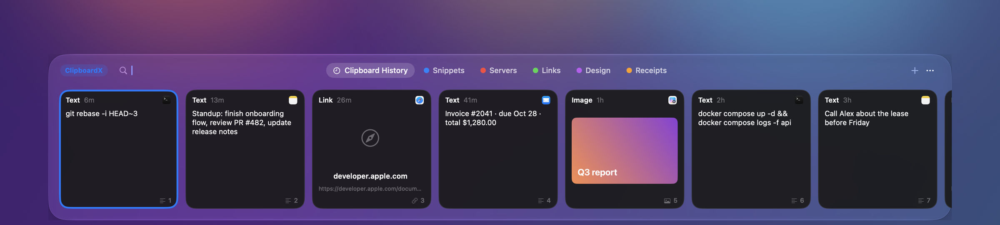
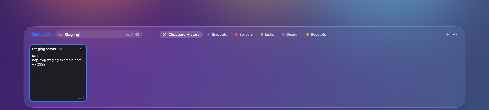

# ClipboardX

A fast, native clipboard manager for macOS, written in Swift. It keeps your whole clipboard history, finds things
the way you remember them, and never deletes anything on its own.

> **Status: early.** It is used daily by its author, but expect rough edges. See [Limitations](#limitations).



Searching `Stag ing` finds the clip named `Staging server` (spacing is ignored):



<sub>Screenshots use a made-up sample library, not real clipboard data. You can generate it yourself with
`swift run cx-import demo --out <empty folder>`.</sub>

## Download

Grab the latest `.dmg` from the [Releases page](https://github.com/emintontul/clipboardx/releases/latest), open it and drag
ClipboardX into Applications. Apple Silicon, macOS 14 or later. The app is not notarized yet, so the first launch needs
**System Settings → Privacy & Security → Open Anyway** (details are in the release notes).

## Why

- **Search that finds what you meant.** Typing `Togg Lite` finds a clip titled `ToggLite`. Spacing, punctuation, case,
  accents and Turkish letters (`ı İ ş ğ`) are ignored, words match in any order, and small typos still match.
  Queries take a few milliseconds on a library of ~110,000 clips.
- **Your history is yours.** Every change is appended to an event log; the search index is derived and can be rebuilt
  at any time. History is never deleted automatically.
- **Native.** SwiftUI and AppKit, Liquid Glass on macOS 26 and later, no web views, no network access.

## Features

- Menu-bar app. `⇧⌘V` opens a shelf at the bottom of the screen (falls back to `⌥⌘V` if another app owns it). Shortcuts are customizable.
- **Two densities, one shelf.** Drag the top edge to make it taller: cards stay square and gain an app-colored header and big previews.
- Cards for text, links, images and files, colored pinboards, `⌘1…9` quick paste, `⇧` for plain text, Quick Look on `Space`.
- **Search that finds what you meant**, plus filters: `type:link`, `app:Safari`, `after:2026-09-01`, `today`, `yesterday`, `last week`, `last month`, or pick them from the filter menu.
- **Nothing is lost by accident.** Delete sends a clip to *Recently Deleted* for 90 days (`⌘⌫`), restore from there. Editing text keeps the original in the library.
- **Pinboards:** create, rename, recolor, reorder and delete (their clips go to the trash with them).
- **Paste Stack** (`⇧⌘C`): copy several things, then paste them one after another from the Paste Stack view.
- **Sync between Macs** over iCloud Drive: each Mac backs itself up there and merges the others' history in. Deletes, renames and pinboards merge too.
- Optional **link previews** (page title and image), off by default.
- Skips content that apps mark as confidential or transient (password managers), plus a list of ignored apps.
- Incremental backup to iCloud Drive every ten minutes, with a completeness check.
- Importer for the local database of another clipboard manager (see below), with a full verification pass.

## Build and run

Requires macOS 14 or later and a recent Swift toolchain.

```sh
swift test                                  # run the test suite
./scripts/build-app.sh                      # builds build/ClipboardX.app, ad-hoc signed
SIGN_IDENTITY="Apple Development: …" ./scripts/build-app.sh   # or sign with your certificate
open build/ClipboardX.app
```

Pasting into other apps needs the **Accessibility** permission (System Settings → Privacy & Security). Without it,
ClipboardX puts the item on the clipboard and you press `⌘V` yourself.

The library lives in `~/ClipboardX-library` (override with the `CLIPBOARDX_LIBRARY` environment variable).

## How it works

```
~/ClipboardX-library/
  log/        append-only JSONL event log, one set of segment files per device   <- source of truth
  blobs/      content-addressed payloads (SHA-256), immutable, LZFSE-compressed  <- source of truth
  index.sqlite  search index and query model (FTS5 trigram)                      <- derived, rebuildable
```

Backups copy the log segments and pack the blobs into large immutable files, so syncing folders never produces
conflicts. Restoring a backup into an empty folder reproduces the library exactly.

## Importing from another clipboard manager

`cx-import` can read the local Core Data store of a supported clipboard manager that you have installed and move
**your own** history into ClipboardX: it works on a read-only snapshot, never touches the original, can be re-run
without creating duplicates, and ends with a verification report that compares every item.

```sh
swift run -c release cx-import import --snapshot <snapshot.sqlite> --external <_EXTERNAL_DATA> --out ~/ClipboardX-library
swift run -c release cx-import verify --snapshot <snapshot.sqlite> --external <_EXTERNAL_DATA> --out ~/ClipboardX-library
```

Take the snapshot with `sqlite3 "file:<db>?mode=ro" "VACUUM INTO '<snapshot.sqlite>'"` while the other app is idle.

## Privacy

ClipboardX makes **no network requests** unless you turn on *link previews* in Settings. When enabled, each link you copy is
sent to its own website to read the title and image. Links to your local network, links with credentials or tokens in them
(`?token=`, `?key=`, `?code=` …) and one-time links such as password resets are never requested. iCloud backup and sync use
iCloud Drive's own folder sync; ClipboardX itself does not talk to any server.

## Limitations

- The library, its backups and the synced copies are **not encrypted** (issue #7). FileVault protects your Mac; iCloud protects
  the folder in transit and at rest on Apple's side.
- Sync was tested with simulated second Macs (including a 110,000-clip history); use on two real Macs is new, please report problems.
  The first sync on a new Mac downloads the other Mac's packs, which can be several GB.
- Not notarized, Apple Silicon only. Do not run it side by side with another clipboard manager: they interfere with each
  other's shortcuts and paste events.
- No ⌘V interception: Paste Stack is driven from the shelf.

## Not affiliated

ClipboardX is an independent project. It is not affiliated with, endorsed by, or derived from the source code of any
other clipboard manager. Product names mentioned belong to their owners.

## Contributing

See [CONTRIBUTING.md](CONTRIBUTING.md). Open issues include a roadmap and good first issues.

## License

MIT, see [LICENSE](LICENSE).
